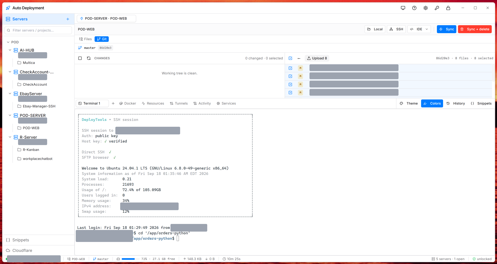

# DeployTools

A fast, all-in-one **desktop control panel for your servers** — SSH terminal, SFTP file sync, Git deploy, Docker, systemd, metrics, tunnels and more, in one native app. A free, open-source **MobaXterm / WinSCP / Termius / JetBrains Deployment alternative** for Windows and macOS.

**Stack:** Tauri 2 · Rust · React 18 · TypeScript · Tailwind + shadcn/ui · xterm.js (WebGL) · russh


[](https://github.com/philipnguyen8588/DeployTools/releases)
[](#license)
[](https://github.com/philipnguyen8588/DeployTools/stargazers)
[](https://buymeacoffee.com/lipnguyen)



> Runs on **Windows** and **macOS**. Encrypted, offline-first, minimal RAM (target < 150 MB with a few open sessions). Keywords: SSH client, SFTP client, terminal, deploy tool, bastion / jump host, Docker & systemd control, server manager.

---

## Features

### Connections & security
- **Encrypted vault** for all credentials — Argon2id key derivation + AES-256-GCM. The master password is never stored.
- **SSH** (password or private key, with passphrase) and **FTP / FTPS** servers.
- **Jump host / ProxyJump** — tunnel a connection through a bastion (inline host/user/key), including multi-hop.
- **Host-key pinning** (TOFU) with mismatch detection for both target and jump host.
- **Multi-tab, multi-session** — open many servers/projects at once, JetBrains-style. Idle auto-disconnect.
- Servers organized into **groups**, drag-to-reorder.

### Integrated terminal
- Real PTY over SSH (russh) rendered with **xterm.js + WebGL** — smooth even under heavy log output.
- **macOS Terminal.app look** — SF Mono / Inter fonts, and **170 built-in color themes** (from macos-terminal-themes) with a searchable picker.
- **Welcome banner** on connect (session info + live system stats: load, memory, disk, IPv4…).
- Optional **output highlighting** (IP addresses, log keywords) with a one-click toggle.
- Auto-`cd` into the project's remote path, per-server **command history**, snippet insertion, copy-on-select / paste, full IME support (incl. Vietnamese Telex).

### Files & deploy
- JetBrains-style **2-pane file browser** — local ↔ remote (SFTP), with compare (file & folder diff).
- **Fast pipelined SFTP upload** — concurrent writes over one channel (orders-of-magnitude faster than one-chunk-at-a-time clients).
- **Git panel** — see working-tree changes and per-commit files, upload selected files to the remote.
- **Smart sync** (SFTP or **rsync**) with per-project excludes (glob) and custom rsync flags; sync-with-delete.
- Single-file or whole-folder upload with live progress + cancel.

### Ops panels (per session)
- **Docker Compose** — list services, up / down / restart / build / pull, stream logs.
- **Systemd services** — browse units, start/stop/restart/status.
- **Resources** — live metrics: CPU, memory, load, disk, network, process list (container-aware).
- **SSH tunnels** — local port forwarding with a click.
- **Cloudflare** — manage DNS records (zones, add/edit/delete) from inside the app.
- **Snippets** — reusable parameterized commands, pasted into the active terminal.
- **IDE launch** — open a project in your editor (auto-detected) from the deploy bar.

### AI agent control (optional)
- Built-in **MCP server** (local, token-auth) so Claude Code / AI agents can connect to projects, run sync, upload git changes and execute commands — with a command guard (denylist) and an audit log.

### UI
- Dark / light / system theme with a macOS-style palette; adjustable app-wide **font size**.
- Fast, fade-only modals; a compact status bar (connection, transfer counters, disk usage).

---

## Install

Grab the latest installer from the [Releases](../../releases) page:
- **Windows:** `Auto Deployment_<version>_x64-setup.exe` (NSIS) or `..._x64_en-US.msi`
- **macOS:** `Auto Deployment_<version>_universal.dmg` (Apple Silicon + Intel)

WebView2 ships with Windows 11; on Windows 10 the installer bootstraps it automatically.

---

## Build from source

### Prerequisites
- **Node.js 20+** — https://nodejs.org
- **Rust (stable)** — `winget install Rustlang.Rustup` then `rustup default stable`
- **Windows:** MSVC C++ Build Tools (*Desktop development with C++* workload)
- **macOS:** Xcode Command Line Tools (`xcode-select --install`)
- **(optional) rsync** — for the rsync sync engine. On Windows, drop `rsync.exe` at `src-tauri/binaries/rsync-x86_64-pc-windows-msvc.exe`, or install cwRsync / Git-Bash rsync; SFTP sync works without it.

### Dev
```bash
npm install
npm run tauri:dev
```
The first `cargo build` pulls the crate graph and takes a few minutes; later builds are incremental.

### Production bundles
```bash
npm run tauri:build
```
Output under `src-tauri/target/release/bundle/` (`.msi` + `.exe` on Windows, `.dmg` + `.app` on macOS).

---

## Security notes
- The master password is **never stored** — forget it and the vault is unrecoverable by design.
- Credentials (passwords, key passphrases) are encrypted at rest; `vault.enc` on disk is only ciphertext + salt + nonce.
- Host keys are pinned on first connect; a changed key blocks the connection until you clear the stored fingerprint.
- rsync arguments are passed as an argument vector (no shell), preventing injection.
- The Tauri CSP blocks all remote content — the webview reaches no external domains.
- The MCP server binds to `127.0.0.1` only and requires a bearer token; `run_command` can be guarded or disabled.

---

## Testing

Spin up a throwaway SSH server:
```bash
docker run -d --name sshd -p 2222:22 \
  -e USER_NAME=dev -e USER_PASSWORD=dev -e PASSWORD_ACCESS=true -e SUDO_ACCESS=true \
  linuxserver/openssh-server:latest
```
Add a server in the app (`host=localhost`, `port=2222`, `user=dev`, `password=dev`) and hit **Test connection** to pin the host key.

Rust unit tests:
```bash
cd src-tauri && cargo test
```
Covers the vault crypto round-trip, unlock / change-password / tamper detection, SFTP path-traversal guard, and secret redaction.

---

## Project layout
```
src-tauri/src/
├── commands/   # Tauri IPC handlers (one file per domain:
│               #   ssh, sftp, deploy, git, docker, services,
│               #   metrics, tunnel, cloudflare, snippets, …)
├── vault/      # Argon2id + AES-GCM encrypted config store
├── ssh/        # russh client, session pool, PTY, pipelined SFTP
├── rsync/      # rsync subprocess runner with streamed logs
├── ftp/        # FTP / FTPS client
├── mcp/        # local MCP server for AI agents
├── models.rs   # Server, Project, JumpHost, Secret, …
└── lib.rs      # Tauri entry + invoke_handler

src/
├── components/ # React components (panels, dialogs, terminal)
├── stores/     # Zustand stores (servers, sessions, prefs, …)
├── lib/        # API wrapper, TS types, ANSI/banner helpers
└── App.tsx     # Top-level shell
```

---

## Support

DeployTools is free and open-source. If it saves you time, you can support development:

<a href="https://buymeacoffee.com/lipnguyen"></a>

☕ **[buymeacoffee.com/lipnguyen](https://buymeacoffee.com/lipnguyen)**

## License

MIT
